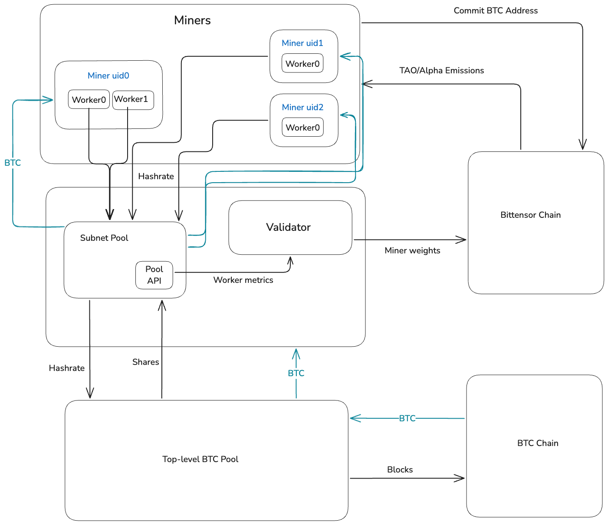

<div align="center">

# **TAO Hash** 
[](https://opensource.org/licenses/MIT)
[](https://deepwiki.com/latent-to/taohash)

</div>

TAO Hash is a Bittensor Subnet for incentivizing and decentralizing the production of proof-of-work (PoW) mining hashrate, rental and exchange. Validators receive hashrate from miners in exchange for issuing weights, while miners contribute hashrate and speculate on hashrate, hashprice and Alpha emissions. Effectively, Alpha is swapped for BTC hashrate automatically.

Although the initial implementation primarily supports Bitcoin mining via Braiins Pool, the architecture is designed to be extensible to other mineable projects with similar capabilities for verifying miner performance presicely and efficiently.

---
- [Incentive Design](#incentive-design)
- [Requirements](#requirements)
  - [Miner Requirements](#miner-requirements)
  - [Validator Requirements](#validator-requirements)
- [Installation](#installation)
  - [Common Setup](#common-setup)
  - [Miner Specific Setup](#miner-specific-setup)
  - [Validator Specific Setup](#validator-specific-setup)
- [Get Involved](#get-involved)
---

# Incentive Design
The core incentive mechanism aligns miners and validators through a market where hashrate is exchanged for on-chain rewards (Alpha). Validators evaluate the hashrate contributed by miners, and miners are incentivized to distribute their hashrate across validator pools proportionally to stake weight to maximize their expected return.



# Requirements

## Miner Requirements
To run a TaoHash miner, you will need:
- A Bittensor wallet
- Bitcoin mining hardware (ASICs, GPUs, etc.) OR access to remote hashrate
- A running Redis server for data persistence
- Python 3.9 or higher
- Docker
- Docker Compose
- Braiins Farm Proxy (Minimal setup provided or use official guide)
- Any BTC Miner software capable of pointing hashrate to a local pool address

## Validator Requirements
To run a TaoHash validator, you will need:
- A Bittensor wallet
- A Braiins Pool account with API access enabled
- Python 3.9 or higher environment

# Installation

## Common Setup
These steps apply to both miners and validators:

1.  **Clone the repository:**
    ```bash
    git clone [https://github.com/latent-to/taohash.git](https://github.com/latent-to/taohash.git)
    cd taohash
    ```

2.  **Set up and activate a Python virtual environment:**
    ```bash
    python3 -m venv venv
    source venv/bin/activate
    ```

3.  **Upgrade pip:**
    ```bash
    pip install --upgrade pip
    ```

4.  **Install the TaoHash package:**
    ```bash
    pip install -e .
    ```

## Miner Specific Setup
After completing the common setup, follow the detailed steps in the Miner Guide:

* [Install Redis](docs/running_braiins_miner.md#2-install-redis)
* [Set up Braiins Farm Proxy and point your miners to it](docs/running_braiins_miner.md#3-set-up-proxy-and-miners)
* [Configure your miner (`.env` file or command-line arguments)](docs/running_braiins_miner.md#5-configuration)
* [Run the miner (using PM2 recommended)](docs/running_braiins_miner.md#6-running-the-miner)

For the complete, step-by-step instructions for setting up and running your miner, please refer to the [TaoHash Miner Setup Guide (BTC Braiins Pool)](docs/running_braiins_miner.md).

## Validator Specific Setup
After completing the common setup, follow the detailed steps in the Validator Guide:

* [Set up your Braiins Pool account and generate API credentials](docs/running_braiins_validator.md#1-braiins-pool-account-setup)
* [Configure your validator (`.env` file or command-line arguments)](docs/running_braiins_validator.md#4-configuration-methods)
* [Run the validator (using PM2 recommended)](docs/running_braiins_validator.md#5-running-the-validator)

For the complete, step-by-step instructions for setting up and running your validator, please refer to the [TaoHash Validator Setup (BTC Braiins pool)](docs/running_braiins_validator.md).

# Get Involved

- Join the discussion on the [Bittensor Discord](https://discord.com/invite/bittensor) in the Subnet 14 channels.
- Check out the [Bittensor Documentation](https://docs.bittensor.com/) for general information about running subnets and nodes.
- Contributions are welcome! See the repository's contribution guidelines for details.

---
**Full Guides:**
- [TaoHash Miner Setup Guide (BTC Braiins Pool)](docs/running_braiins_miner.md)
- [TaoHash Validator Setup (BTC Braiins pool)](docs/running_braiins_validator.md) 
