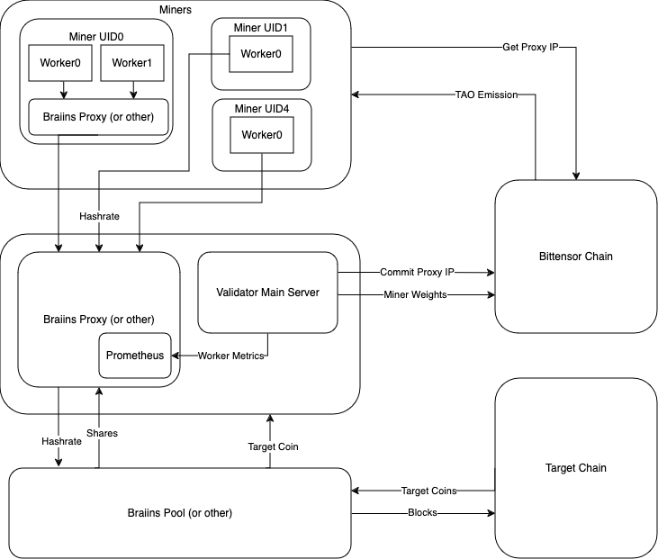

# **TAO Hash** <!-- omit in toc -->
 
 
  

TAOHash is a Subnet for decentralizing PoW mining hashrate- rental and exchange. Validators receive hashrate in exchange for weights, and miners speculate on hashrate, hashprice, and Alpha emissions. Effectively, Alpha is swapped for BTC automatically. Although the initial implementation only supports Bitcoin mining, this can be extended to other mine-able projects with the same ability to verify miner performance quickly.

---
- [Incentive Design](#incentive-design)
- [Requirements](#requirements)
  - [Miner Requirements](#miner-requirements)
  - [Validator Requirements](#validator-requirements)
  - [Installation](#installation)
    - [Miner](#miner)
    - [Validator](#validator)
---

# Incentive Design

# Requirements

<!-- TODO -->
## Miner Requirements
- git
- Docker
- Docker-Compose
- Ubuntu 20.04+
- [Braiins Proxy](https://github.com/braiins/farm-proxy?tab=readme-ov-file#quick-start) 
- Any BTC Miner (hardware and software) with the ability to mine to a pool address

## Validator Requirements

## Installation
### Miner
- [Install Docker](https://docs.docker.com/engine/install/ubuntu/)
- [Install Docker compose](https://docs.docker.com/compose/install/)
- [Install Braiins Proxy](https://github.com/braiins/farm-proxy?tab=readme-ov-file#quick-start)

### Validator

