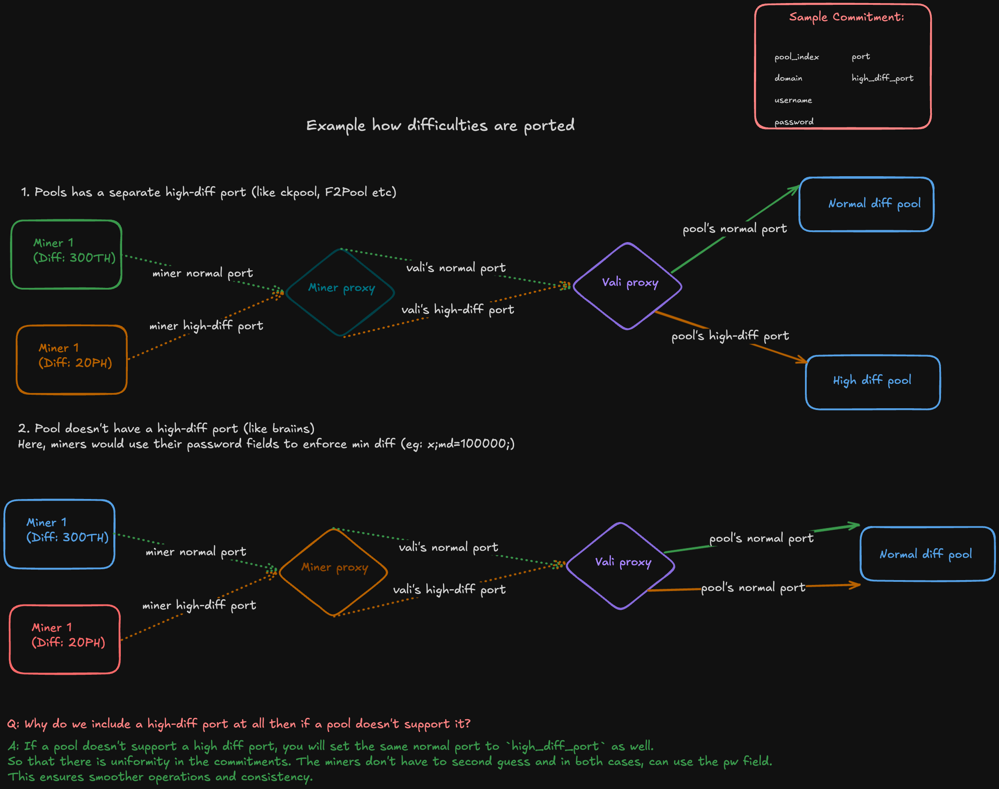

# v0.2.0

## What Changed for Miners

- **New Taohash Proxy**: Miners can use either the lightweight version included in this repository or the full version at [taohash-proxy](https://github.com/latent-to/taohash-proxy)  
  The proxy provides:
    - Support for high difficulty miners in Braiins (see mechanism below)
    - Real-time dashboard showing connected miners, hashrate, and share statistics (updates every 10 seconds)
    - Faster switching between validators within time windows
- **Share-Based Evaluation**: Miners are now evaluated on submitted shares rather than raw hashrate. Validators calculate the exact share difficulty for accurate evaluations.
- **Setup Guide**: See the [miner setup guide](../docs/running_braiins_miner.md) and [.env.miner.example](../taohash/miner/.env.miner.example) for configuration details.

## What Changed for Validators

- **Proxy Requirement**: Validators must use the [Taohash proxy](https://github.com/latent-to/taohash-proxy) to evaluate miners. Complete setup instructions are provided in the repository. In terms of their commitment, they will need to publish their proxy's IP in the `domain` field and ports in their respective fields accordingly. 
- **Extended Pool Support**: This update adds support for solo mining and other FPPS pools. Validators only need to commit their proxy server connection details to Bittensor and control hashrate flow through upstream pools defined in `config.toml`.
- **Hot Swapping**: The proxy supports pool hot swapping during execution via a private API.
- **Configuration**: See [.env.validator.example](../taohash/validator/.env.validator.example) for required environment variables to configure your commitments and script.
- **Dashboard & Analytics**: The validator's proxy also includes a more extensive dashboard, showing individual mining machines while aggregating same usernames. It also provides share history along with the share's hash that was actually submitted. Abilities to export as json or csv are also included. 

Detailed instructions on how to setup pools through the proxy is listed in [Taohash proxy](https://github.com/latent-to/taohash-proxy). 

## Changes in Evaluations

**Previous Method**: Miners were evaluated based on raw hashrate provided to a specific pool.

**New Method**: Miners are evaluated based on the value of shares submitted to validator pools. Share difficulty is calculated by reconstructing the blockhash of each submitted share.

## Support for High Difficulty Miners

The proxy supports setting minimum difficulty using the password field (e.g., `x;md=10000;`):
- Once minimum difficulty is set, the proxy applies the rule: `max(miner_requested_difficulty, pool_difficulty)`
- If pool difficulty is lower, the miner's requested difficulty is used
- When pool difficulty exceeds the requested difficulty, control returns to the pool

**Example with Braiins Pool**:
- Braiins starts with a vardiff of 8,400
- If a miner sets 100,000 minimum difficulty, this becomes the initial difficulty (since 100,000 > 8,400)
- The pool gradually adjusts difficulty based on share submission rate

**Key Insight**: Higher hashpower enables faster difficulty adjustment. With sufficient hashpower (e.g., 10 PH/s), optimal difficulty can be reached within 2-3 minutes instead of 12+ minutes with lower hashpower such as 3PH/s.

**Important**: We advise miners using high difficulty settings with Braiins proxy to deploy machines with at least 20 PH/s hashpower. Higher hashpower enables the pool's vardiff algorithm to reach optimal difficulty faster, minimizing the ramp-up period. This translates directly to more incentive. 

## Support for High Difficulty Ports

This update introduces high difficulty ports to validator commitments. Each proxy instance (miner or validator) opens two ports:
- **Standard port** (eg: 3331): For normal difficulty miners
- **High difficulty port** (eg: 3332): For high difficulty miners

This feature enables validators to support upstream high difficulty ports from pools like CKPool, reducing the time required for mining machines to reach optimal difficulty as compared to using minimum difficulty settings with vardiff. 

- Miners and validators, both open a high-difficulty port. 
- This should be opened even if the validators are using Braiins which doesn't support high difficulty. This is to preserve uniformity. The miners will still be evaluated based on their username. 

## Upcoming roadmap

We intend to phase in the updated subnet design in a series of steps to ensure smooth transition with minimal disruptions. 

 - **Disbursement of BTC**: After the share based system is adopted in the subnet, we will implement TIDES based disbursements. 
 
    TIDES calculates rewards by using `network difficulty × 8` as the baseline, then distributes BTC to miners proportionally based on the total share value they submitted during the evaluation window. 
    This system incentivizes consistent hashrate delivery, as miners who maintain steady mining and submit more shares throughout the window receive a larger portion of the BTC rewards.

    The infrastructure required by validators to achieve this is already included in this push. 
