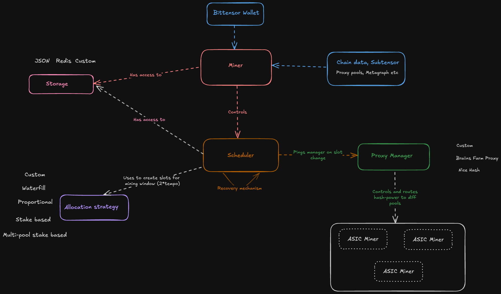
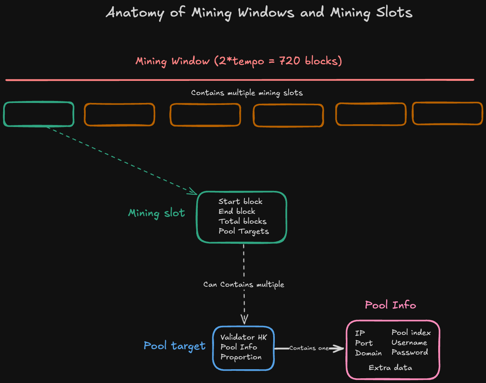
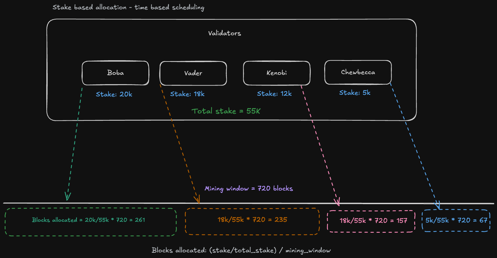
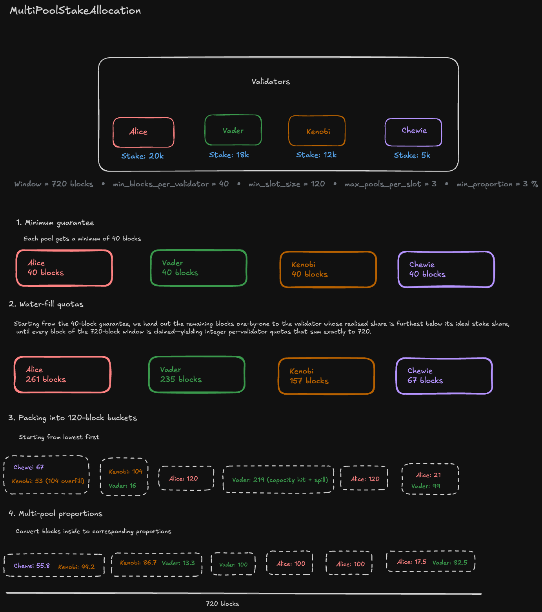

# TaoHash Miner Setup Guide (BTC Braiins Pool)
This guide will walk you through setting up and running a TaoHash miner to contribute Bitcoin hashrate to validators on the Bittensor network.

* [Overview](#overview)
* [Prerequisites](#prerequisites)
* [Setup Steps](#setup-steps)
    * [1. Bittensor Wallet Setup](#1-bittensor-wallet-setup)
    * [2. Install Redis](#2-install-redis)
    * [3. Set up Proxy and Miners](#3-set-up-proxy-and-miners)
        * [1. Braiins Farm Proxy](#1-braiins-farm-proxy)
        * [2. Nice Hash](#2-nice-hash)
    * [4. Install TaoHash](#4-install-taohash)
    * [5. Configuration](#5-configuration)
    * [6. Running the miner](#6-running-the-miner)
    * [Important Parameters](#important-parameters)
* [Mining and resource allocation details](#mining-and-resource-allocation-details)
* [Mining Window and Slots](#mining-window-and-slots)
* [Allocation Strategies](#allocation-strategies)
    * [Stake based allocation (Time splitting)](#stake-based-allocation-time-splitting)
    * [Equal distribution (Time splitting)](#equal-distribution-time-splitting)
    * [Multi-Pool Stake Allocation (Time & Hashrate Splitting)](#multi-pool-stake-allocation-time--hashrate-splitting)
* [Ending notes](#ending-notes)


## Overview
The TaoHash miner orchestrates Bitcoin mining operations by intelligently routing your hashrate to validator pools according to on-chain stake weights. The system consists of these main components:

## Prerequisites
1. A Bittensor wallet
2. Bitcoin mining hardware (ASICs etc) OR remote hashrate 
3. Redis server for data persistence
4. Python 3.9 or higher

## Setup Steps
## 1. Bittensor Wallet Setup

Ensure you have created a Bittensor wallet. If you haven't, you can create one using:
```bash
pip install bittensor-cli
btcli wallet create
btcli subnet register --netuid 14 --wallet.name YOUR_WALLET --wallet.hotkey YOUR_HOTKEY --network finney
```
You can use the network `test` when testing on testnet. 

## 2. Install Redis

### Ubuntu/Debian
```bash
sudo apt update && sudo apt install redis-server -y
sudo systemctl enable redis-server
sudo systemctl start redis-server
```
### MacOS
```bash
brew install redis
brew services start redis
```
### Verify installation
```bash
redis-cli ping
```
You should receive PONG as a response.

## 3. Set up Proxy and Miners
### 1. Braiins Farm Proxy
Here you have two options:
#### 1. Minimal setup 
There is already a minimal Braiins Farm setup in `miner > proxy > braiins_farm` directory.
You can navigate to the directory and run
```bash
docker compose up -d
```
This minimal setup:
1. Doesn't contain analytics which come bundled with full Braiins Farm proxy setup (Grafana, Prometheus etc.)
2. Starts 2 services: `farm-proxy` and `farm-proxy-configurator`

`farm-proxy` is the main service which routes your mining hashrate to different pools. 

`farm-proxy-configurator` is used to load the updated config in `active_profile.toml` to the `farm-proxy` service. 

These two are sufficient to run the whole miner setup. There are health-checks in place but you can always extend them as you like. 
#### 2. Full setup:
You can also do your own setup using [Official Github](https://github.com/braiins/farm-proxy?tab=readme-ov-file). 

Once you complete the setup and have everything running, make sure you pass the `directory path` of the cloned folder:

`--proxy_base_path "/Users/<user>/Desktop/farm-proxy"`

The full setup will contain a Grafana dashboard which can show you statistics of your mining hashpower and a split of where the hashrate was provided over time. 

Once you are done configuring the proxy, you need to point your mining machines to the proxy machine. 

By default, the port is `3333`and the Stratum Host should be your local IP address 

`ifconfig | grep "inet " | grep -v 127.0.0.1 | awk '{print $2}'`

The username and password doesn't matter here as the proxy config files will have your workerid (derived through your hotkey) already set with the prper pool name. 

### 2. Nice Hash
Coming soon

## 4. Install TaoHash

```bash
# Clone repository
git clone https://github.com/latent-to/taohash.git
cd taohash

# Create and activate virtual environment
python -m venv venv
source venv/bin/activate

# Install dependencies
pip install -e .
```
## 5. Configuration

You can configure the miner using either a .env file (recommended) or command-line arguments.

### Option 1: Using .env File (Recommended)
1. Create a `.env` file in the project root based on the provided example:
```bash
cd taohash/miner
cp .env.miner.example .env
```

2. Edit the `.env` file with your credentials:
```bash
nano .env
cd ../.. # Return to the root dir
```
### Option 2: Using Command-Line Arguments

All settings can be passed as command-line arguments when starting the miner.

## 6. Running the miner

PM2 provides process management with automatic restarts:

1. Install PM2
```bash
sudo apt update && sudo apt install nodejs npm -y
sudo npm install pm2@latest -g
pm2 startup
```

2. Start the miner
```bash
# Using .env file
pm2 start python3 --name "taohash-miner" -- taohash/miner/braiins.py run \
    --subtensor.network finney \
    --logging.info

# Using command-line arguments
pm2 start python3 --name "taohash-miner" -- taohash/miner/braiins.py run \
    --netuid 14 \
    --subtensor.network finney \
    --wallet.name YOUR_WALLET_NAME \
    --wallet.hotkey YOUR_HOTKEY \
    --storage_type redis \
    --allocation.type stake_based \
    --proxy_port 3333 \
    --logging.info

# Or without PM2
python3 taohash/miner/braiins.py run \
    --netuid 14 \
    --subtensor.network finney \
    --wallet.name YOUR_WALLET_NAME \
    --wallet.hotkey YOUR_HOTKEY \
    --storage_type redis \
    --allocation.type stake_based \
    --proxy_port 3333 \
    --logging.info
```
3. Save PM2 config 
```bash
pm2 save
```

## Important Parameters
- `netuid`: Set to 14 for TaoHash subnet
- `subtensor.network`: Set to `finney` for mainnet
- `wallet.name`: Your Bittensor wallet name
- `wallet.hotkey`: Your wallet's hotkey
- `storage_type`: Storage backend (redis recommended)
- `allocation.type`: Strategy for distributing hashrate
- `allocation.min_blocks`: Minimum blocks per validator (default: 40)
- `allocation.min_stake`: Minimum stake threshold for validators (10_000)
- `proxy_port`: Port of the Proxy for miners to connect to (default: 3333)

---

# Mining and resource allocation details


## Incentive

In TaoHash, miners earn rewards by contributing hash-rate to multiple validator pools—**the more stake a pool has, the higher your expected return**.
Miners speculate on hashrate, hashprice, and Alpha emissions. 


### Goal
Distribute your hash-rate across pools **proportionally to the on-chain stake weight**.


### Constraints

1. **Minimum Coverage:** Serve at least **X** pools per window (default: 10). Focusing on one validator yields zero score from the rest, possibily reducing overall emissions.
2. **Stake-Weighted Split:** Allocate hash-rate in proportion to each validator’s stake weight.  


### Top level Example

A miner has **20 TH/s** total hash-rate and four validators:

| Validator | Stake Weight |
|:---------:|-------------:|
| **A**     | 20 000       |
| **B**     | 18 000       |
| **C**     | 12 000       |
| **D**     |  5 000       |

**Allocation:**

| Validator | Allocation (TH/s) |
|:---------:|------------------:|
| **A**     | 7.20              |
| **B**     | 6.54              |
| **C**     | 4.36              |
| **D**     | 1.80              |

> By splitting the hash-rate this way, you **maximize** your expected reward and emissions. 


## Ways to split hash-rate

1. **Firmware/OS level Multi-Pools**  
   - Use mining OS or firmware that natively splits shares across pools (e.g., LuxOS, NiceHash – up to 3 pools).  
   - Older Antminer models supported multi-pool out of the box.

2. **Window-Based Scheduling**  
Mining window is defined the same as the validator's evaluation window (2 * tempo = 2 * 360 = 720 blocks ~ 144 minutes or 2.5 hours)
   1. **Compute fair-share** for each of the top X validators:  
      ```text
      fair_share_i = (stake_i / ∑ stake) × mining_window
      ```  
   2. **Slice into time slots**—mine validator A for its share of blocks, then B, etc.  
   or
      **Split hashrate** Serve multiple pools at the same time by splitting hashrate through proportions

Both approaches achieve the same end result: you allocate X pools proportionally and receive on-chain rewards accordingly.


## Evaluation

- Validators sample contributed hash-rate at regular intervals (every **5 minutes**).  
- They calculate your earned value by multiplying provided hash-rate by the current **BTC hash-price**.  
- At the end of the evaluation window (2 * tempo), each validator aggregates all miner contributions and updates on-chain weights.

> Properly coordinated splitting—whether via firmware or scheduled slots—ensures you meet the **minimum coverage** requirement and optimize your **incentives**.  


## Miner components

### - Bittensor Wallet: 
Manages cryptographic keys and identity for subnet registration and Bittensor operations. 

### - Miner file
Core orchestration component that coordinates validator selection, hashrate allocation, and manages the mining lifecycle.

### - Storage
Persistent data layer (JSON or Redis) that stores pool configurations, schedules, and mining state between restarts.

### - Allocation Strategy: 
Algorithms determining hashrate distribution across different pools. This component decides who gets how much hashrate each validator pool is allocated. 

### - Scheduler: 
Time-based coordinator that executes mining slots, tracks current active mining pool, and notifies proxy when targets change.

### - Proxy Manager: 
This is the component to which the mining hardware is connected. `update_config` gets invoked by the scheduler to change mining targets based on slot/window changes. 

We have provided 2 implementations to start with:
#### Braiins Farm Proxy
1. To use this, you need to point your `Stratum Host` in your physical miner to the Proxy's IP and Port. 
2. The proxy farm will be connecting to the validator pools and route traffic to your physical miner machines. 
3. Upon slot change, the implemented `update_config` will be invoked to switch the targets by updating the `active_profile.toml` file and restarting the proxy configurator. 

### Nice Hash
Coming soon
### Visual sketch


---

## Mining Window and Slots

### Mining Window: 
A fixed-length period (720 blocks, ~2.5 hours) that defines the evaluation cycle for miners. Each can contain multiple mining slots scheduled according to the allocation strategy.
This window is open to change but be advised that validators have the same evaluation window (720 blocks) after which they submit their evaluations to the chain.

### Mining Slot: 
A discrete time segment within a mining window defined by start and end blocks. Each slot specifies which validator(s) to mine for during that period, with configurable parameters to ensure minimum coverage.
A mining slot can contain one or multiple pool targets if hashrate splitting is allowed. 

### Pool Target
Individual validator mining assignment within a slot, containing the validator's hotkey, connection details (IP, port, credentials), and proportion of hashrate to direct to this validator if multiple targets exist in the same slot.



## Allocation Strategies

We define basic allocation strategies for miners to split their hash-rate based on window-based scheduling.
These strategies are a base-line and sort of a reference; miners are incentived come up with optimal and refined algorithms for most efficient splitting. 

### Stake based allocation (Time splitting)

This default strategy distributes mining blocks proportionally based on stake weight. It's a greedy approach that prioritizes validators with higher stake:
1. Fair Share Calculation: Each validator receives blocks based on their relative stake in the network (stake_validator / total_stake)
2. Minimum Guarantee: Ensures each validator receives at least min_blocks_per_validator (default: 40)
3. Priority Order: Processes validators in descending stake order
4. Efficient Usage: Any remaining blocks are added to the last validator's allocation

This strategy balances reward maximization (by favoring high-stake validators) while ensuring minimum coverage requirements are met for smaller stakeholders.


### Equal distribution (Time splitting)

This strategy implements an egalitarian approach that ignores stake weights:
1. Even Division: Divides available blocks equally among all eligible validators
2. Remainder Handling: Distributes any leftover blocks (one each) to the first N validators
3. Minimum Guarantee: Still ensures each validator receives at least min_blocks_per_validator

While this approach doesn't optimize for stake-weighted rewards, it provides perfectly balanced coverage across all validators that meet minimum stake requirements.


###  Multi-Pool Stake Allocation (Time & Hashrate Splitting)
This advanced strategy enables mining for multiple validators simultaneously within a single slot:
1. Water-Fill Distribution: Uses a progressive filling algorithm to fairly distribute blocks based on stake weights
2. Efficient Packing: Bundles smaller allocations together into slots of at least min_slot_size blocks (default: 120)
3. Concurrent Mining: Allows up to max_pools_per_slot validators (default: 3) to share a single mining slot
3. Proportional Splitting: Each validator in a slot receives hashrate proportional to their quota
#### Requirements: Compatible mining proxy software capable of hashrate splitting (e.g., Braiins Proxy with multiple physical miners)

This approach offers the most efficient use of hashrate while maintaining fairness, allowing miners to serve multiple validators simultaneously by splitting hashrate.



## Ending notes

- Miners can connect their own setup or write their own proxy instance to control their miners whatever way they see fit. 

- By default, the miner stores pool informations (with defined TTLs) and the latest schedule in the storage. This was deliberate as to provide flexibility for individuals to consume it as they see fit or permanently store in persistent storage for analytics. 

- Each allocation strategy have different parameters through which it can be controlled. Feel free to read them and tweak/update as needed for your use-case. 

- Validators complete the evaluation of miner work output after 1 full window (2 * tempo). They poll the proxy pools every 5 minutes (25 blocks) to fetch miner contributions. 

- We welcome open-source collaborations! You can find more information about contributions in our github. 

- We will be expanding to support other coins and pools in the future. 

- To run on different environments, check out [Subnet tutorials](https://docs.bittensor.com/tutorials/basic-subnet-tutorials)

Happy TaoHashing! 

