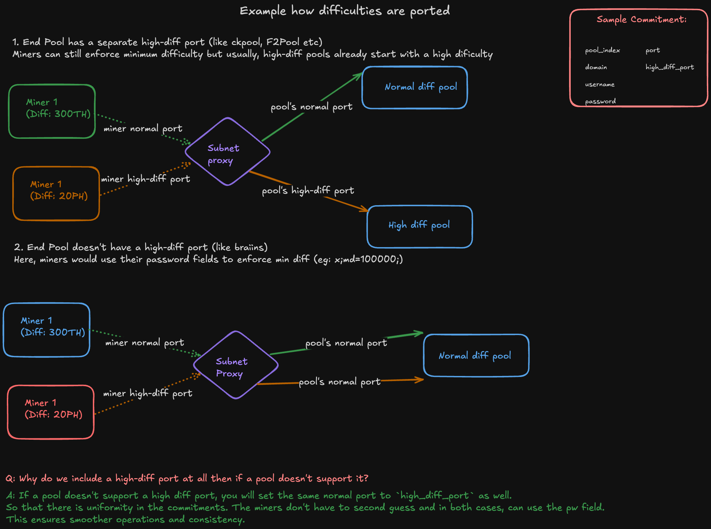

# TaoHash Mining Guide
Complete guide for mining on the TaoHash subnet - Bittensor's Bitcoin mining network.

## Overview
TaoHash enables Bitcoin miners to contribute hashpower to the subnet's mining pool. All miners direct their hashpower to a single subnet pool, where validators evaluate and rank miners based on the share value they generate.
Miners are reward in Alpha token in Bittensor, which can be swapped to the mother token, TAO. 

### What is share value? 
Share value is the difficulty at which the miner solved a blockhash. The higher the difficulty solved, the more incentive a miner gets. 
In general, the higher the hashpower, the higher the share values are submitted. 

## Prerequisites
- Bitcoin mining hardware (ASICs)
- Python 3.10 or higher
- Bittensor wallet

## Quick Start

### Step 1: Wallet Setup
Create and register a Bittensor wallet on subnet 14:

```bash
# Install Bittensor CLI
pip install bittensor-cli

# Create a new wallet
btcli wallet create

# Register on subnet 14 (mainnet)
btcli subnet register --netuid 14 --wallet.name YOUR_WALLET --wallet.hotkey YOUR_HOTKEY --network finney
```

### Step 2: Get Pool Information
Fetch your mining pool configuration:

```bash
# Clone the repository
git clone https://github.com/latent-to/taohash.git
cd taohash

# Install dependencies
pip install -e .

# Get your mining configuration
python taohash/miner/miner.py \
    --wallet.name YOUR_WALLET \
    --wallet.hotkey YOUR_HOTKEY \
    --subtensor.network finney
```

This outputs your pool configuration:
```
=== SUBNET POOL CONFIGURATION ===

Normal Pool:
  URL: 178.156.163.146:3331
  Worker: latent-to.5EX7d4Eu
  Password: x

High Difficulty Pool:
  URL: 178.156.163.146:3332
  Worker: latent-to.5EX7d4Eu
  Password: x
```

### Step 3: Configure Your Miners
Use the pool information to configure your ASIC miners:
- **Stratum URL**: Use the pool URL from Step 2
- **Worker Name**: Use the exact worker name provided
- **Password**: x

Once entering the pool information, the Subnet's proxy will automatically register your contributions against your hotkey and you will start accumulating alpha. 

### Step 4: Monitor Performance
Track your mining performance at: **https://taohash.com/leaderboard**

The leaderboard shows:
- Current hashrate contribution
- Share value generated
- Ranking among all miners
- Historical performance

## Setting Minimum Difficulty

High-performance ASICs may require minimum difficulty settings. Append the minimum difficulty to your password:

```
x;md=100000;
```
Note: It is important to follow the format of setting the difficulty. 



## Legacy Mining Script

The `miner_with_proxy.py` script is still supported and automatically mines to the subnet pool:

```bash
python taohash/miner/miner_with_proxy.py \
    --wallet.name YOUR_WALLET \
    --wallet.hotkey YOUR_HOTKEY \
    --subtensor.network finney
```

## Troubleshooting

**Cannot connect to pool**
- Verify pool information using `miner.py`
- Check firewall settings
- Ensure wallet is registered on subnet 14

**High rejection rate**
- Check network latency
- Update miner firmware

**Not showing on leaderboard**
- Use exact worker name from pool info
- Allow 30 minutes for statistics
- Verify shares are being accepted

---

## Advanced: Proxy Setup

You can use the miner proxy in-cases where you want all the hashpower from your miners to be directed at one point.
From that point, it can communicate with the subnet's proxy. 
This approach works well and has been in the works at the subnet level in the past. 

### Benefits:
- Real-time dashboard with statistics
- No manual worker configuration

### Installation:

1. **Start the proxy service:**
```bash
cd taohash/miner/proxy/taohash_proxy
docker compose up -d
```
Make sure the correct ports are configured and update the `config.toml` to contain the subnet's proxy information. 

2. **Configure miners to connect to proxy:**
- Stratum URL: `<your_local_ip>:3331`
- Worker: Any name
- Password: x

3. **Access dashboard:**
Visit `http://<your_local_ip>:8100` for real-time statistics.

4. **Run the miner script**
- Next you need to run the miner script so it can hot-load the configuration for you. 
- You can choose to skip this step and update the config.toml yourself (it will stay static anyway).

---

For support: https://github.com/latent-to/taohash/issues

Happy TaoHashing!